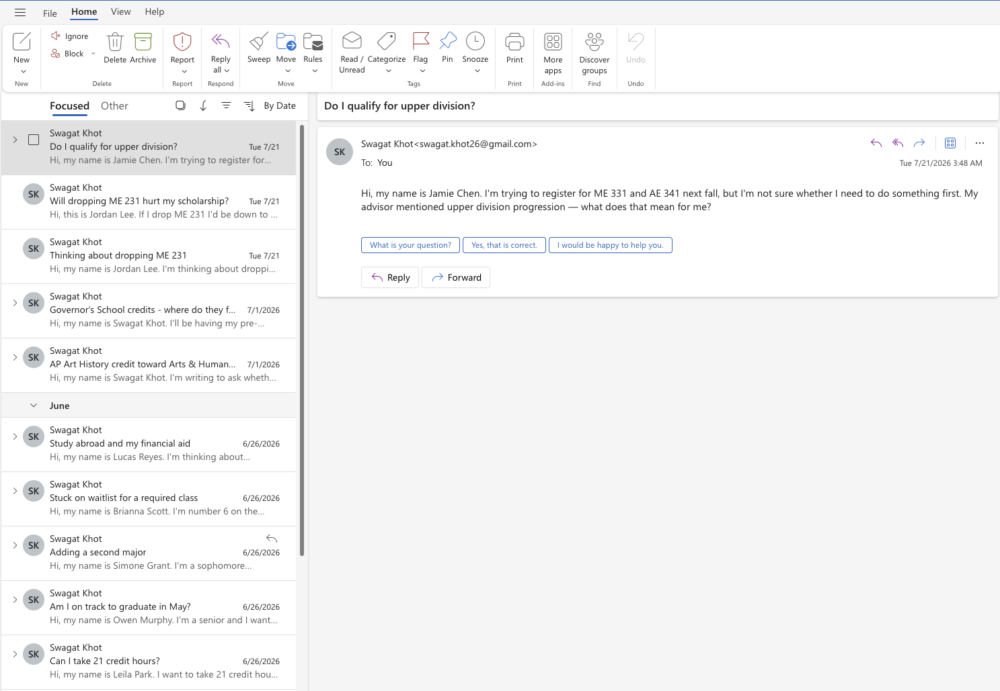
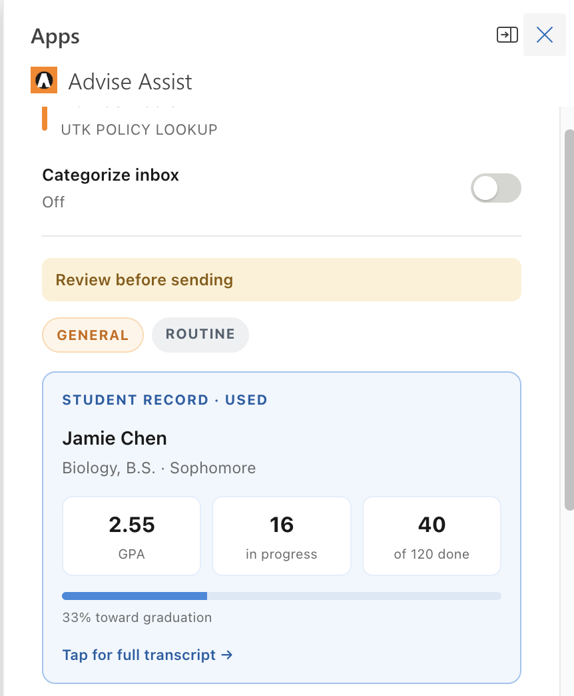
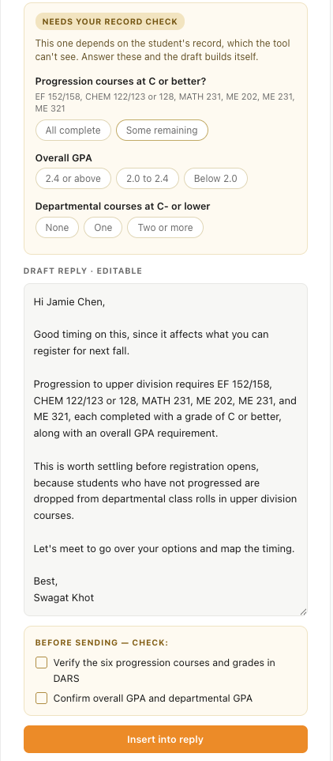
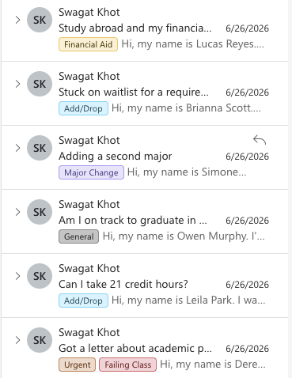

# Advise Assist

**An AI assistant that lives inside an academic advisor's Outlook inbox, so advisors spend less time answering the same student email and more time actually advising.**

Built solo for academic advisors at the University of Tennessee, Knoxville. Tested by four advisors, currently in pilot conversations with the university.

> Showcase repository. The full source is private. Representative samples are in [`src-samples/`](src-samples/).



---

## The problem

Academic advisors are hired to counsel students. In practice, a large share of the job is email triage: the same twenty questions about drop deadlines, major changes, transfer credit, and academic probation, asked hundreds of times a semester. Each one makes the advisor look up a policy they already know and rewrite an answer they have already written.

The answers exist. They are scattered across the course catalog, the registrar, departmental pages, and the advisor's own memory. Nothing captures them, so every advisor re-derives them alone.

## What it does

The advisor opens a student email and a panel appears beside it.

<table>
<tr>
<td width="50%" valign="top">

<br><br>
<b>Triage and context.</b> Category, urgency, and the student's degree progress: GPA, credits in progress, progress toward graduation, with the full transcript and prerequisite chains one tap away.
</td>
<td width="50%" valign="top">

<br><br>
<b>A draft the advisor edits, not writes.</b> Editable in the panel, inserted into the reply in one click, with a pre-send checklist of what to verify.
</td>
</tr>
</table>

One toggle categorizes and color-tags the whole inbox using native Outlook categories, so a morning's mail can be triaged at a glance.



The core thesis: **editing a draft beats writing from a blank page.** The advisor always reviews, and the tool never sends anything on its own. Mental-health emails are deliberately never auto-drafted, because those need a person.

## The interesting problem: answering questions about data the AI is not allowed to see

Student academic records are FERPA-protected, and university policy keeps that data out of AI tools. Most competing products integrate directly with the student information system, which requires a negotiated data agreement before a single advisor can try them.

But the most valuable advising answers are exactly the ones that depend on the record. "Do I qualify for upper division?" cannot be answered from policy alone.

**The approach: the advisor supplies the facts, the tool supplies the reasoning.** When a question is record-dependent, the panel does not guess and does not ask for the record. It asks the advisor a few multiple-choice questions, then assembles the draft from their answers.

> **NEEDS YOUR RECORD CHECK**
> This one depends on the student's record, which the tool can't see. Answer these and the draft builds itself.
>
> Progression courses at C or better? · Overall GPA · Departmental courses at C- or lower

Three taps' worth of questions the advisor can read straight off their own screen. The model never receives the record, and the draft is still specific and correct.

The rest of the privacy design follows the same principle:

1. **PII is stripped before anything leaves the device.** Two layers: regex for student IDs, emails, phones, SSNs, GPAs, and dollar amounts, plus spaCy named-entity recognition for names and organizations. ([`src-samples/scrubber.py`](src-samples/scrubber.py))
2. **The model only ever sees de-identified text and public policy.**
3. **Identifying details merge into the finished draft client-side, after the AI call**, so the student's name and record never enter the model at any point.

A browser-side scrubbing proof of concept (transformers.js with `Xenova/bert-base-NER`) is built. Once it ships, raw email never leaves the advisor's machine at all.

## How it works

```
Outlook task pane  (Office.js add-in, hosted on Vercel)
        │
        │  one POST per email
        ▼
FastAPI backend  (hosted on Render)
        │
        ├─ scrub          strip PII locally (regex + spaCy NER)
        ├─ categorize     category / urgency / complexity        (LLM)
        ├─ canonicalize   anonymized, reusable form of the question
        ├─ context        policy retrieval, with a verified fallback
        ├─ judge          decision + draft + advisor checklist   (LLM)
        └─ referral       which office to route to
        │
        ▼
   one JSON contract, sliced across the whole UI
```

The frontend hits the backend **once** per email. Switching tabs, editing the draft, answering the record-check questions, and opening the transcript popup are all local, so the panel never stalls mid-task.

**Retrieval.** A RAG pipeline embeds the real policy corpus into a Qdrant vector store ([`src-samples/rag.py`](src-samples/rag.py)). Prose policy gets embedded. Dates and lookup tables deliberately do not, because embeddings cannot do date math or exact-score lookups. Those run through plain Python that computes the fact and injects it into the prompt, for example "the drop-without-W deadline passed on Aug 24, so a drop now shows a W at the 60% refund stage." The model never reasons about dates itself.

**Stack:** Python · FastAPI · Groq (`llama-3.1-8b-instant`) · spaCy · LangChain · Qdrant · Office.js · MSAL / Microsoft Graph · Render · Vercel

Model choice is deliberate and swappable. A fast, cheap model is the right call while iteration speed is the constraint; the reasoning step is a drop-in swap to a stronger model once accuracy becomes the binding one.

## What advisors said

Four academic advisors tested it against their own workflow.

- One rated it **5/5 and said they would want the university to purchase it**, estimating it would save "a lot" of time.
- Another called it **"a framework to build off of."**
- One advisor, unprompted, asked for the feature that is the product's long-term thesis: **let advisors correct the AI's knowledge base so a fix propagates to every advisor in the department.** That shared, verified corpus is the part a competitor cannot copy.
- A **department head** saw the demo and initiated an introduction to the university's IT organization.

The consistent criticism was accuracy on complex, multi-part questions. That is the honest weak spot and it is what the retrieval work targets: drafts were being generated against a small hand-written answer set rather than the real policy corpus.

## Code samples

The full codebase is private, but two representative files are included:

| File | What it shows |
|---|---|
| [`src-samples/scrubber.py`](src-samples/scrubber.py) | Two-layer PII removal. The interesting part is disambiguation: `3/15` is a deadline, `45/100` after "scored" is a grade, and a GPA gets bucketed into a severity band rather than blanked, so the model still knows the student is in trouble without learning the number. |
| [`src-samples/rag.py`](src-samples/rag.py) | The retrieval pipeline: corpus loading with front-matter parsing so every answer carries a citation link, embedding, persistent vector store, and a grounded-answer prompt that returns `NO_INFO` rather than inventing policy. |

## Status

Working prototype with real users in the loop. The student records in the demo are synthetic, because real integration requires a negotiated data agreement with the university, which is what the pilot conversation is for. Every advisor who tested it was told this up front.

**Next:** replace the hand-written answer set with retrieval over the full policy corpus · let advisors correct answers in the panel so fixes propagate department-wide · move PII scrubbing fully into the browser · read attachments into the draft.

---

Built by [Swagat Khot](https://github.com/WTCSwagat). Source available on request.
